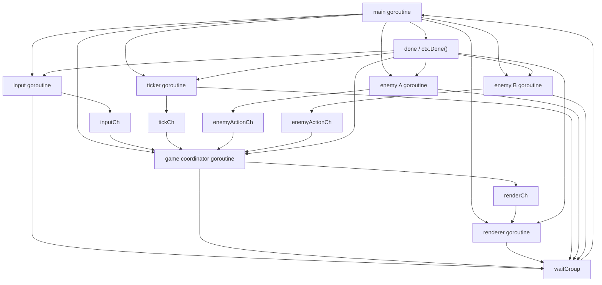

# Documento de Arquitetura

## Projeto Proposto

### Nome sugerido
**Arena Concorrente**

### Resumo
O projeto proposto é um jogo/simulação de terminal em Go no qual o jogador precisa sobreviver em uma arena 2D textual enquanto inimigos autônomos se movimentam e atacam de forma independente. A concorrência faz parte da arquitetura central: cada componente relevante executa em sua própria goroutine e toda a coordenação ocorre por meio de channels.

Essa proposta foi escolhida porque:

- é simples de apresentar;
- é fácil de implementar incrementalmente;
- atende com clareza todos os requisitos da disciplina;
- permite justificar bem o uso de goroutines, channels e `select`.

---

## Visão Geral da Arquitetura

### Ideia central
A arquitetura será **centralizada em um coordenador do jogo**. Em vez de várias goroutines alterarem o estado compartilhado diretamente, cada goroutine envia eventos para uma goroutine principal de coordenação. Isso reduz risco de `data race`, facilita o shutdown e torna a lógica mais fácil de explicar na apresentação.

### Goroutines principais

1. **Main goroutine**
   Inicializa channels, cria as demais goroutines, aguarda encerramento e finaliza o programa.

2. **Input goroutine**
   Lê comandos do jogador no terminal e envia ações pelo channel `inputCh`.

3. **Game Coordinator goroutine**
   É o núcleo da aplicação. Recebe eventos de input, de inimigos, de ticks de tempo e de shutdown. Atualiza o estado do jogo e publica snapshots para renderização.

4. **Renderer goroutine**
   Recebe snapshots imutáveis do estado do jogo e redesenha a tela do terminal em tempo real.

5. **Enemy A goroutine**
   Entidade autônoma com comportamento independente. Em intervalos regulares, decide movimento/ataque e envia intenção para o coordenador.

6. **Enemy B goroutine**
   Segunda entidade autônoma, com a mesma estrutura, mas comportamento independente.

7. **Ticker goroutine**
   Gera pulsos de tempo para avançar a simulação, controlar cooldowns e padronizar o ritmo do jogo.

Essa arquitetura já atende o requisito de **pelo menos 4 goroutines com papéis distintos**, e inclui **pelo menos 2 entidades autônomas com goroutines próprias**.

---

## Diagrama de Goroutines e Channels



### Leitura do diagrama

- `main` cria todas as goroutines.
- `input goroutine` envia comandos do jogador para `inputCh`.
- `ticker goroutine` envia pulsos periódicos para `tickCh`.
- `enemy A` e `enemy B` enviam intenções de ação para `enemyActionCh`.
- `game coordinator` processa todos os eventos recebidos e envia snapshots para `renderCh`.
- `done` ou `context cancellation` sinaliza o encerramento coordenado.
- `WaitGroup` garante que o processo só termina após todas as goroutines encerrarem.

---

## Papel de Cada Goroutine

### 1. Main goroutine
- cria `context.Context` de cancelamento ou channel `done`;
- inicializa channels;
- sobe todas as goroutines;
- espera condição de término;
- dispara o shutdown;
- aguarda todas as goroutines via `sync.WaitGroup`.

### 2. Input goroutine
- lê comandos digitados pelo usuário;
- converte texto em comandos de domínio, por exemplo `up`, `down`, `left`, `right`, `attack`, `quit`;
- envia esses comandos para `inputCh`.

### 3. Game Coordinator goroutine
- mantém o estado oficial do jogo;
- processa input do jogador;
- processa ações autônomas dos inimigos;
- processa ticks do relógio;
- detecta colisões, dano, vitória e derrota;
- gera snapshots para renderização;
- decide quando iniciar o encerramento do sistema.

### 4. Renderer goroutine
- recebe snapshots do estado;
- limpa a tela;
- desenha arena, jogador, inimigos, HUD e mensagens;
- não decide regras do jogo;
- usa apenas estado pronto para exibição.

### 5. Enemy A goroutine
- executa de forma independente;
- usa temporização própria;
- calcula intenção de movimento ou ataque;
- envia eventos para o coordenador;
- não altera o estado global diretamente.

### 6. Enemy B goroutine
- mesma responsabilidade estrutural do Enemy A;
- comportamento independente, permitindo estratégias diferentes e melhor demonstração de autonomia concorrente.

### 7. Ticker goroutine
- dispara eventos periódicos para o avanço do tempo lógico do jogo;
- ajuda a separar “passagem do tempo” da lógica de input e de IA.

---

## Estrutura de Comunicação

### Channels sugeridos

```go
inputCh       chan PlayerCommand
enemyActionCh chan EnemyAction
tickCh        chan Tick
renderCh      chan GameSnapshot
doneCh        chan struct{}
```

### Por que essa organização?

- evita múltiplas goroutines escrevendo no mesmo estado;
- centraliza as transições de estado em um único lugar;
- facilita rastrear eventos na apresentação;
- reduz muito o risco de `data race`;
- torna o uso de `select` natural e justificável.

### Alternativas consideradas

#### 1. Estado compartilhado com mutex entre várias goroutines
Foi descartado como arquitetura principal porque:

- aumenta complexidade;
- dificulta explicar consistência;
- amplia risco de interleavings problemáticos;
- enfraquece o papel dos channels no projeto.

#### 2. Cada entidade alterando o mapa diretamente
Também foi descartado porque:

- dificulta manter regras consistentes;
- aumenta risco de conflito entre ações simultâneas;
- torna o shutdown e a renderização mais frágeis.

#### 3. Arquitetura totalmente distribuída sem coordenador central
Foi considerada, mas não escolhida para este trabalho porque seria mais difícil de apresentar e depurar dentro do prazo.

---

## Uso de `select`

O `select` será usado principalmente na **goroutine do Game Coordinator**.

### Exemplo conceitual

```go
for {
    select {
    case cmd := <-inputCh:
        // processa comando do jogador
    case action := <-enemyActionCh:
        // processa ação de inimigo
    case <-tickCh:
        // atualiza tempo, cooldowns e lógica periódica
    case <-ctx.Done():
        // encerra a goroutine de forma graciosa
        return
    }
}
```

### Papel de cada `case`

- `inputCh`: recebe ações do jogador.
- `enemyActionCh`: recebe ações das entidades autônomas.
- `tickCh`: faz o avanço periódico do jogo.
- `ctx.Done()` ou `doneCh`: interrompe a goroutine de forma segura.

Esse ponto atende diretamente ao requisito de **uso de `select` para multiplexar operações**.

---

## Análise de Concorrência

### Onde poderia ocorrer deadlock

#### 1. Envio para channel sem receptor ativo
Se uma goroutine tentar enviar para um channel não-bufferizado quando o receptor não estiver consumindo, ela pode bloquear indefinidamente.

**Prevenção:**
- manter o `game coordinator` sempre ativo enquanto o jogo roda;
- usar encerramento coordenado;
- opcionalmente usar buffers pequenos em channels de eventos.

#### 2. Encerramento fora de ordem
Se o coordenador parar antes das goroutines produtoras, inimigos ou input podem continuar tentando enviar mensagens.

**Prevenção:**
- todas as goroutines observam `ctx.Done()` ou `doneCh`;
- produtores interrompem seus loops antes de continuar enviando;
- `main` só finaliza após `WaitGroup`.

### Onde poderia ocorrer goroutine leak

#### 1. Input bloqueado para sempre
Uma goroutine de leitura de terminal pode ficar presa esperando entrada.

**Prevenção:**
- preferir leitura por linha com comando `quit`;
- tratar fim de jogo também por cancelamento;
- limitar a responsabilidade da goroutine para que ela pare ao detectar EOF, erro ou cancelamento.

#### 2. Inimigos com loops infinitos sem condição de saída
Se o loop da IA não observar o sinal de encerramento, a goroutine continuará viva após o fim do jogo.

**Prevenção:**
- cada entidade autônoma deve ter `select` com caso de cancelamento;
- a temporização deve ser interrompida no shutdown.

#### 3. Renderer aguardando snapshot que nunca chega
Se o renderer depender de novos frames sem observar cancelamento, ele pode ficar bloqueado.

**Prevenção:**
- renderer também observa `ctx.Done()` ou fechamento ordenado do channel.

---

## Shutdown Gracioso

O encerramento gracioso será implementado com o seguinte fluxo:

1. O jogo detecta condição de término: comando `quit`, derrota do jogador ou vitória.
2. A goroutine coordenadora ou a `main` chama `cancel()` do contexto compartilhado.
3. Todas as goroutines recebem o sinal por `ctx.Done()`.
4. Cada goroutine encerra seu loop, libera timers se necessário e chama `wg.Done()`.
5. A `main` faz `wg.Wait()` e só então termina o programa.

### Vantagens dessa abordagem

- evita vazamento de goroutines;
- evita finalização abrupta;
- facilita testes;
- é simples de demonstrar na apresentação.

---

## Visualização em Tempo Real no Terminal

### Escolha recomendada
Para este projeto, a melhor escolha é **ANSI escape codes** em vez de uma biblioteca externa.

### Justificativa

- menor dependência externa;
- implementação suficiente para o escopo do trabalho;
- mais fácil de explicar;
- mantém foco na concorrência, que é o objetivo principal da disciplina.

### Estratégia de renderização

- limpar a tela a cada frame;
- redesenhar arena e HUD;
- usar snapshots imutáveis enviados pelo coordenador;
- permitir que apenas a goroutine de renderização escreva no terminal.

Isso evita conflito de saída entre múltiplas goroutines.

---

## Como o Projeto Atende aos Requisitos

- **Pelo menos 4 goroutines com papéis distintos:** main, input, coordinator, renderer, ticker, enemy A e enemy B.
- **Comunicação por channels:** toda a coordenação principal usa channels.
- **Uso de `select`:** concentrado no `game coordinator` e opcionalmente nas entidades.
- **Pelo menos 2 entidades autônomas:** enemy A e enemy B.
- **Shutdown gracioso:** via `context cancellation` e `WaitGroup`.
- **Visualização em tempo real:** renderer dedicado no terminal com ANSI.

---

## Conclusão

A arquitetura proposta equilibra três objetivos importantes para este trabalho:

- facilidade de implementação;
- clareza de apresentação;
- uso correto e justificável de concorrência em Go.

O ponto mais forte do desenho é a separação entre **produção de eventos concorrentes** e **atualização centralizada de estado**, o que facilita tanto a robustez do sistema quanto a explicação acadêmica das decisões de projeto.
