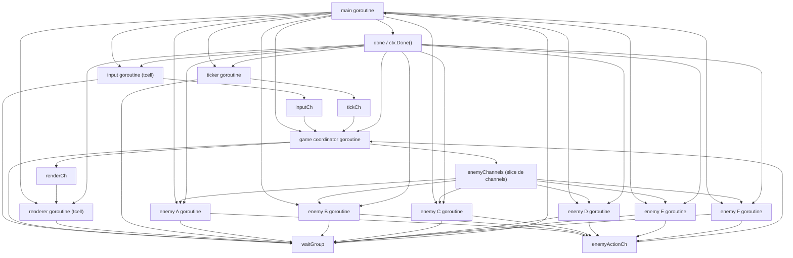

# Documento de Arquitetura

## Projeto Proposto

### Nome Sugerido

**Arena Concorrente**

### Resumo

O projeto proposto e um jogo/simulacao de terminal em Go no qual o jogador precisa sobreviver em uma arena 2D textual de 25x25 enquanto 6 inimigos autonomos se movimentam e atacam de forma independente. A concorrencia faz parte da arquitetura central: cada componente relevante executa em sua propria goroutine e toda a coordenacao ocorre por meio de channels.

Projeto desenvolvido por Rodrigo e Vitor.

Essa proposta foi escolhida porque:

- e simples de apresentar;
- e facil de implementar incrementalmente;
- atende com clareza todos os requisitos da disciplina;
- permite justificar bem o uso de goroutines, channels e `select`.

---

## Visao Geral da Arquitetura

### Ideia Central

A arquitetura e **centralizada em um coordenador do jogo**. Em vez de varias goroutines alterarem o estado compartilhado diretamente, cada goroutine envia eventos para uma goroutine principal de coordenacao. Isso reduz risco de `data race`, facilita o shutdown e torna a logica mais facil de explicar na apresentacao.

### Goroutines Principais

1. **Main goroutine**
    Inicializa a tela do `tcell`, cria os channels, sobe as demais goroutines, aguarda encerramento via `sync.WaitGroup` e finaliza o programa graciosamente.
2. **Input goroutine**
    Le comandos do jogador no terminal em "raw mode" (captura de setas e espaco em tempo real usando a biblioteca `tcell`) e envia acoes pelo channel `inputCh`.
3. **Game Coordinator goroutine**
    E o nucleo da aplicacao. Recebe eventos de input, de inimigos, de ticks de tempo e de shutdown. Atualiza o estado do jogo (movimentacao, combate, travamento de tela no game over) e publica snapshots para renderizacao e para as entidades autonomas.
4. **Renderer goroutine**
    Recebe snapshots imutaveis do estado do jogo e redesenha a tela do terminal instantaneamente usando a tecnica de *double-buffering* do `tcell`, sem causar cintilacao (*flicker*).
5. **Enemy goroutines (A, B, C, D, E e F)**
    Sao 6 entidades autonomas com comportamento independente. Cada inimigo executa em sua propria goroutine, possuindo um `time.Ticker` exclusivo (ex: 800ms, 1200ms). Em intervalos regulares, decidem movimento/ataque (patrulha ou perseguicao) e enviam intencao para o coordenador.
6. **Ticker goroutine**
    Gera pulsos de tempo continuos para avancar a simulacao, atualizar a HUD e padronizar o ritmo logico do jogo.

Essa arquitetura atende e supera o requisito de **pelo menos 4 goroutines com papeis distintos**, e inclui **6 entidades autonomas com goroutines proprias**.

---

## Diagrama de Goroutines e Channels



### Leitura do Diagrama

- main cria a tela, canais e todas as goroutines.
- input goroutine captura as setas/espaco do jogador e envia para inputCh.
- ticker goroutine envia pulsos periodicos para tickCh.
- as goroutines dos inimigos enviam intencoes de acao para um canal compartilhado enemyActionCh.
- game coordinator processa todos os eventos concorrentes em um bloco `select`, e envia snapshots para renderCh e para um slice de enemyChannels.
- done (via context cancellation) sinaliza o encerramento coordenado.
- WaitGroup garante que o processo so termina apos todas as goroutines encerrarem.

---

## Estrutura de Comunicacao

### Channels Utilizados

```go
inputCh       chan PlayerCommand
enemyActionCh chan EnemyAction
tickCh        chan Tick
renderCh      chan GameSnapshot
enemyChannels []chan GameSnapshot // Slice para N inimigos
```

### Por Que Essa Organizacao?

- evita multiplas goroutines escrevendo no mesmo estado (mapa/arena) simultaneamente;
- centraliza as transicoes de estado (regras do jogo) em um unico lugar;
- facilita rastrear eventos na apresentacao;
- elimina o risco de data race sem a necessidade de espalhar `sync.Mutex` pelo codigo;
- torna o uso de `select` natural, poderoso e altamente justificavel.

---

## Obstaculos e Colisoes

O mapa inclui obstaculos aleatorios gerados no inicio da partida. Essas paredes sao intransponiveis para o jogador e para os inimigos (bloqueiam movimento em todas as direcoes). Para manter a integridade do jogo, o algoritmo de spawn garante que nem o jogador nem os inimigos nascam dentro de obstaculos.

## Navegacao dos Inimigos

Para evitar que os inimigos fiquem presos batendo em paredes, a persecucao usa uma busca em largura (BFS) calculada a partir do snapshot recebido. Cada inimigo decide a acao localmente com dados imutaveis e comunica apenas a intencao via channel.

## Renderizacao com Emojis

Os sprites sao emojis (largura dupla). A renderizacao usa celulas com largura dupla para garantir que obstaculos e personagens nao se sobreponham visualmente no grid.

---

## Alternativas Consideradas

### 1. Estado Compartilhado com Mutex entre Varias Goroutines

Foi descartado como arquitetura principal porque:

- aumenta a complexidade de raciocinio logico;
- dificulta explicar consistencia;
- amplia o risco de interleavings problematicos e deadlocks;
- enfraquece o papel central dos channels, que sao o grande diferencial do Go.

### 2. Cada Entidade Alterando o Mapa Diretamente

Tambem foi descartado porque:

- dificulta manter regras consistentes de colisao;
- aumenta risco de conflito entre acoes simultaneas (dois inimigos indo para a mesma casa);
- torna o shutdown e a renderizacao muito frageis.

---

## Uso de select

O `select` e usado de forma central na goroutine do Game Coordinator.

### Exemplo Conceitual da Implementacao

```go
for {
     select {
     case <-ctx.Done():
          // encerra a goroutine de forma graciosa
          return
     case cmd := <-inputCh:
          // processa comando do jogador ou trava se o jogo acabou
     case action := <-enemyActionCh:
          // processa intencao de movimento/ataque dos inimigos
     case tick := <-tickCh:
          // atualiza interface e tempo logico
     }
}
```

### Papel de Cada Case

- `ctx.Done()`: prioridade maxima. Interrompe a goroutine de forma segura ao sinal de `cancel()`.
- `inputCh`: recebe acoes do jogador. Se o estado do jogo for GameOver ou Victory, ele trava movimentacoes e aguarda apenas o comando quit (tecla Esc).
- `enemyActionCh`: multiplexa as acoes de todos os 6 inimigos autonomos recebidas em um unico canal.
- `tickCh`: avanca o tempo de jogo sem bloquear o restante.

Esse ponto atende de forma irretocavel ao requisito de uso de `select` para multiplexar operacoes.

---

## Analise de Concorrencia

### Onde Poderia Ocorrer Deadlock

1. **Envio para channel sem receptor ativo**
    Se o Coordenador tentar enviar snapshots para o Renderer ou Inimigos enquanto eles processam algo anterior, a aplicacao poderia travar.
    Prevencao: uso de buffers nos canais (`make(chan GameSnapshot, 1)`) e de envio com clausula default (`select { case ch <- snap: default: }`), garantindo operacoes non-blocking.
2. **Encerramento fora de ordem**
    Se o coordenador parar antes das goroutines produtoras, inimigos ou input continuariam tentando enviar mensagens, causando um vazamento silencioso.
    Prevencao: todas as goroutines observam ativamente o `ctx.Done()`. Produtores param imediatamente, e a main so finaliza apos o WaitGroup confirmar a morte de todos.

### Onde Poderia Ocorrer Goroutine Leak

1. **Input bloqueado para sempre**
    Uma goroutine de leitura tradicional com bufio poderia ficar presa no `os.Stdin`.
    Prevencao: a migracao para a biblioteca `tcell` permite a verificacao continua (`PollEvent()`) e o shutdown natural da interface de terminal devolve o controle ao console limpo.
2. **Inimigos com loops infinitos**
    Se o `time.Ticker` do inimigo nao fosse parado, a goroutine e o timer continuariam vivos.
    Prevencao: uso estrito de `defer ticker.Stop()` e verificacao constante de cancelamento de contexto dentro do loop de vida do inimigo.

---

## Shutdown Gracioso

O encerramento gracioso esta implementado com o seguinte fluxo de eventos:

1. O jogador aperta a tecla Esc (no meio da partida, na vitoria ou na derrota).
2. A goroutine de Input captura a tecla e envia um `CommandQuit`.
3. O Coordenador recebe, altera `ShouldQuit = true` e chama `cancel()` do contexto compartilhado.
4. O canal `ctx.Done()` e fechado. Todas as 10 goroutines ativas quebram seus lacos `for`.
5. Recursos como Tickers da IA e do sistema sao limpos.
6. A tela do `tcell` executa o seu `defer screen.Fini()` para nao bugar o terminal do Windows/Linux.
7. O `wg.Wait()` destrava e a aplicacao encerra retornando 0.

---

## Visualizacao em Tempo Real no Terminal

### Escolha e Justificativa

Conforme permitido nas instrucoes (Requisito 6), adotamos a biblioteca `tcell`. Originalmente planejou-se ANSI escape codes, porem o ANSI tradicional via `fmt.Print` no Windows causava forte cintilacao (*flickering*) e o input bloqueante tornava a jogabilidade impraticavel frente a inimigos assincronos.

O `tcell` soluciona isso entregando:

- raw mode input: leitura instantanea de teclado (setas e espaco);
- double-buffering: atualiza apenas os caracteres do grid de 25x25 que efetivamente mudaram de posicao.

Isso permite focar a complexidade na arquitetura de concorrencia, deixando o front-end estavel.

---

## Como o Projeto Atende aos Requisitos

- Pelo menos 4 goroutines com papeis distintos: atendido com sobras (Main, Input, Coordinator, Renderer, Ticker e multiplos inimigos).
- Comunicacao por channels: toda a coordenacao (mudanca de estado) usa channels estritamente, abolindo mutexes no dominio.
- Uso de `select`: amplamente explorado no Game Coordinator, Input e Enemies para lidar com a simultaneidade.
- Pelo menos 2 entidades autonomas: atendido (temos 6 inimigos com logicas e ritmos totalmente autonomos).
- Shutdown gracioso: fluxo blindado com `context` e `WaitGroup`.
- Visualizacao em tempo real: implementado elegantemente via `tcell`.

---

## Conclusao

A arquitetura final nao apenas atende aos requisitos academicos da disciplina de FPPD, mas demonstra um caso pratico do proverbio classico do Go: "Nao se comunique compartilhando memoria; compartilhe memoria se comunicando". A dissociacao entre produtores de eventos e o nucleo logico central garantiu um codigo imune a condicoes de corrida, facilmente escalavel (como demonstrado ao ampliar de 2 para 6 inimigos) e simples de apresentar.